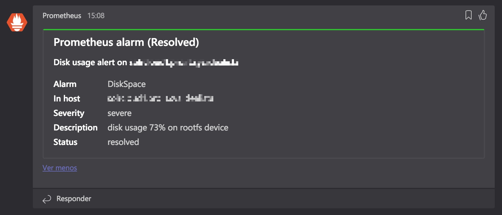

# prom2teams



**prom2teams** is a HTTP server built with Python that receives alert notifications from a previously configured [Prometheus Alertmanager](https://github.com/prometheus/alertmanager) instance and forwards it to [Microsoft Teams](https://teams.microsoft.com/) using defined connectors.

- [Getting Started](#getting-started)
	- [Prerequisities](#prerequisities)
	- [Installing](#installing)
- [Usage](#usage)
  - [Config file](#config-file)
	- [Configuring Prometheus](#configuring-prometheus)
	- [Templating](#templating)
- [Built With](#built-with)
- [Versioning](#versioning)
- [Authors](#authors)
- [License](#license)
- [Contributing](#contributing)

## Getting Started

### Prerequisites

The application has been tested with _Prometheus 1.7.1_, _Python 3.6.2_ and _pip 9.0.1_.

Newer versions of _Prometheus/Python/pip_ should work but could also present issues.

### Installing

prom2teams could be installed using pip:

```bash
$ pip install prom2teams
```

## Usage

```bash
# To start the server (a config file path must be provided, Jinja2 template is optional):
$ prom2teams start --configpath <config file path> [--templatepath <Jinja2 template file path>]

# To show the help message:
$ prom2teams --help
```

### Config file

The config file is an [INI file](https://docs.python.org/3/library/configparser.html#supported-ini-file-structure) and should have the structure described below:

```
[HTTP Server]
Host: <host ip> # default: 0.0.0.0
Port: <host port> # default: 8089

[Microsoft Teams]
Connector: <webhook url> # required value
```

### Configuring Prometheus

The [webhook receiver](https://prometheus.io/docs/alerting/configuration/#<webhook_config>) in Prometheus allows configuring a prom2teams server.

The url is formed by the host and port defined in the previous step.

```
# The prom2teams endpoint to send HTTP POST requests to.
url: 0.0.0.0:8089
```

### Templating

prom2teams provides a [default template](app/teams/template.j2) built with [Jinja2](http://jinja.pocoo.org/docs/2.9/) to render messages in Microsoft Teams. This template could be overrided using the 'templatepath' argument ('--templatepath <Jinja2 template file path>') during the application start.

## Built With


## Versioning

For the versions available, see the [tags on this repository](https://github.com/idealista/prom2teams/tags).

Additionaly you can see what change in each version in the [CHANGELOG.md](CHANGELOG.md) file.

## Authors

* **Idealista** - *Work with* - [idealista](https://github.com/idealista)

See also the list of [contributors](https://github.com/idealista/prom2teams/contributors) who participated in this project.

## License


This project is licensed under the [Apache 2.0](https://www.apache.org/licenses/LICENSE-2.0) license - see the [LICENSE](LICENSE) file for details.

## Contributing

Please read [CONTRIBUTING.md](CONTRIBUTING.md) for details on our code of conduct, and the process for submitting pull requests to us.
